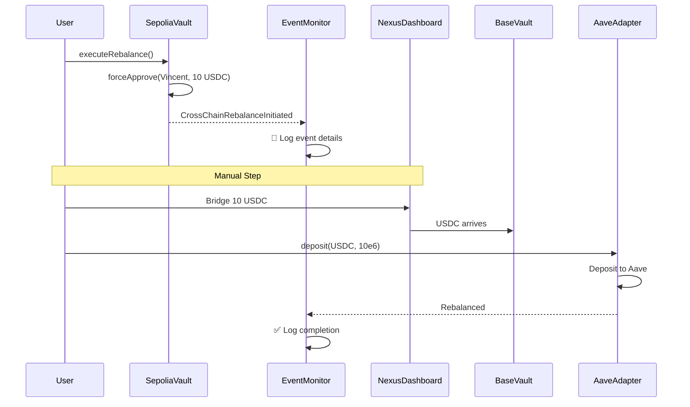

# 🎯 CURRENT STATUS & NEXT STEPS

## ✅ What's Done

### 1. Smart Contracts Deployed

-   **Sepolia Vault**: `0xa36Fa2Ad2d397FC89D2e0a39C8E673AdC6127c2a`
-   **Sepolia Aave Adapter**: `0x018e2f42a6C4a0c6400b14b7A35552e6C0f41D4E`
-   **Base Sepolia Vault**: `0x34Cc894DcF62f3A2c212Ca9275ed2D08393b0E81`
-   **Base Sepolia Aave Adapter**: `0x73951d806B2f2896e639e75c413DD09bA52f61a6`

### 2. Cross-Chain Rebalance Initiated ✅

-   **Transaction**: Successfully executed `TestCrossChainRebalance.s.sol`
-   **Result**: Vault approved Vincent (deployer) to spend 10 USDC
-   **Event**: `CrossChainRebalanceInitiated` emitted with:
    -   Amount: 10 USDC
    -   From: Sepolia (chain 11155111)
    -   To: Base Sepolia (chain 84532)
    -   Protocol change: Aave → Aave

### 3. Event Monitor Running 🎧

-   **Status**: ✅ ACTIVE
-   **Terminal**: ID `9a0f104d-dee5-43bb-bbe5-b3d4ff8e6f5c`
-   **Listening For**:
    -   `CrossChainRebalanceInitiated` events
    -   `Rebalanced` events (completion)
-   **Networks**: Sepolia + Base Sepolia

---

## 🔄 What's Next (YOUR TURN!)

You now need to complete the bridge manually via Nexus Dashboard. The event monitor will detect any new rebalancing events.

### Next Action: Bridge via Nexus Dashboard

**📍 Step 1: Go to Nexus**

-   URL: https://nexus.availproject.org

**📍 Step 2: Connect Wallet**

-   Connect your deployer wallet
-   Switch to Sepolia network

**📍 Step 3: Bridge USDC**

-   Token: USDC
-   Amount: 10 USDC
-   From: Ethereum Sepolia
-   To: Base Sepolia

**📍 Step 4: Execute on Destination**
After bridge completes, call:

-   Contract: `0x73951d806B2f2896e639e75c413DD09bA52f61a6`
-   Function: `deposit(address,uint256)`
-   Params:
    -   `asset`: `0x036CbD53842c5426634e7929541eC2318f3dCF7e` (Base Sepolia USDC)
    -   `amount`: `10000000` (10 USDC)

---

## 📊 How to Verify Success

### 1. Check Event Monitor

The event monitor will show a `Rebalanced` event when the deposit completes:

```
✅ REBALANCED COMPLETED
────────────────────────────────────────────────────
User: 0x...
Amount: 10.0 USDC
From Protocol: 0 (Aave Sepolia)
To Protocol: 1 (Aave Base Sepolia)
APY Gain: X.XX%
```

### 2. Verify On-Chain

```bash
cd contracts

# Check Base Sepolia adapter has USDC deposited
cast call 0x73951d806B2f2896e639e75c413DD09bA52f61a6 "totalAssets()" --rpc-url $BASE_SEPOLIA_RPC_URL

# Expected output: 10000000 (10 USDC)
```

### 3. Check Aave Dashboard

-   Go to https://staging.aave.com/
-   Connect wallet
-   Switch to Base Sepolia
-   Should see ~10 USDC deposited

---

## 🎥 What's Happening Behind the Scenes



---

## 🏗️ Architecture Overview

### Current Setup (Manual)

```
User Wallet
    ↓
Sepolia Vault (approved 10 USDC to Vincent)
    ↓
[YOU MANUAL STEP]
    ↓
Nexus Dashboard (bridge USDC)
    ↓
Base Sepolia (execute deposit)
    ↓
Aave Adapter (deposit to Aave)
    ↓
Event Monitor (logs completion ✅)
```

### Production Setup (Future)

```
Event Monitor (Node.js)
    ↓
Nexus SDK (Headless Browser)
    ↓
Vincent Automation (Lit Protocol)
    ↓
Fully Automated ✨
```

---

## 🐛 Troubleshooting

### Event Monitor Not Showing Past Events?

The monitor only listens for NEW events. The `CrossChainRebalanceInitiated` event from your test was already emitted.

To see it, you would need to:

1. Re-run the test script, OR
2. Modify monitor to fetch past events (see TESTING_GUIDE.md)

### Can't Find USDC on Nexus?

Make sure:

-   You're on the correct network (Sepolia)
-   USDC contract: `0x94a9D9AC8a22534E3FaCa9F4e7F2E2cf85d5E4C8`
-   You have sufficient balance

### Deposit Function Reverts?

Check:

-   USDC arrived on Base Sepolia after bridge
-   Sufficient gas (ETH) on Base Sepolia
-   Using correct USDC address for Base Sepolia: `0x036CbD53842c5426634e7929541eC2318f3dCF7e`

---

## 📚 Reference Documentation

1. **TESTING_GUIDE.md** - Complete step-by-step testing instructions
2. **VINCENT_REVISED_ARCHITECTURE.md** - Production architecture design
3. **HOW_TO_TEST_NEXUS.md** - Multiple Nexus testing approaches
4. **CROSS_CHAIN_FLOW.md** - Technical flow diagrams
5. **event-monitor/README.md** - Event monitor documentation

---

## 🎉 Success Criteria

You'll know everything works when:

1. ✅ Event monitor shows `CrossChainRebalanceInitiated` (already done by test script)
2. ✅ Nexus bridge completes (10 USDC arrives on Base Sepolia)
3. ✅ Deposit to Aave succeeds (adapter.totalAssets() = 10e6)
4. ✅ Event monitor shows `Rebalanced` completion event
5. ✅ Aave dashboard shows deposit on Base Sepolia

---

## 🚀 Ready to Go!

**Your event monitor is LIVE and listening!**

Now complete the bridge via Nexus Dashboard and watch the magic happen! 🪄

Terminal with event monitor: ID `9a0f104d-dee5-43bb-bbe5-b3d4ff8e6f5c`

To see output: Check the terminal or trigger a new rebalancing event to see real-time detection!

**Happy testing!** 🎊
